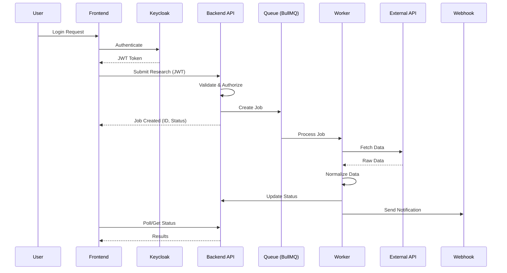

# Product Research Aggregator (PRA) - System Design Document

## Table of Contents
1. [Executive Summary](#1-executive-summary)
2. [System Architecture Overview](#2-system-architecture-overview)
3. [Component Design](#3-component-design)
4. [Data Architecture](#4-data-architecture)
5. [Security Architecture](#5-security-architecture)
6. [API Design](#6-api-design)
7. [Infrastructure & Deployment](#7-infrastructure--deployment)
8. [Technology Stack](#8-technology-stack)
9. [Development Standards](#9-development-standards)
10. [Monitoring & Observability](#10-monitoring--observability)

---

## 1. Executive Summary

### 1.1 Purpose
The Product Research Aggregator (PRA) is a cloud-native platform designed to automate and streamline product research workflows for commercial organizations. This document outlines the technical architecture for the MVP, focusing on the "Researcher" persona while establishing foundations for future multi-role workflow expansion.

### 1.2 Scope
This design covers the MVP implementation including:
- User authentication and authorization
- Research task submission and management
- External API integration for data collection
- Basic data normalization (5-7 fields)
- Webhook notification system
- Asynchronous job processing

### 1.3 Key Design Principles
- **Scalability**: Microservices architecture with horizontal scaling capabilities
- **Security**: Defense-in-depth with centralized authentication
- **Maintainability**: Monorepo structure with shared configurations
- **Extensibility**: Plugin-based architecture for future API integrations
- **Reliability**: Fault-tolerant design with retry mechanisms

---

## 2. System Architecture Overview

### 2.1 High-Level Architecture

```
┌─────────────────────────────────────────────────────────────────┐
│                         External Systems                         │
│  ┌──────────────┐  ┌──────────────┐  ┌────────────────────┐   │
│  │   SerpAPI    │  │   Webhook    │  │    Keycloak        │   │
│  │  (Data API)  │  │   Endpoints  │  │  (Identity Provider)│   │
│  └──────────────┘  └──────────────┘  └────────────────────┘   │
└─────────────────────────────────────────────────────────────────┘
                              ▲
                              │
┌─────────────────────────────────────────────────────────────────┐
│                        PRA Platform                              │
│                                                                  │
│  ┌────────────────────────────────────────────────────────┐    │
│  │                    Frontend (React)                      │    │
│  │  ┌──────────┐  ┌──────────┐  ┌──────────────────┐     │    │
│  │  │   Auth   │  │ Research │  │    Dashboard     │     │    │
│  │  │  Module  │  │   Forms  │  │    & Results     │     │    │
│  │  └──────────┘  └──────────┘  └──────────────────┘     │    │
│  └────────────────────────────────────────────────────────┘    │
│                              │                                   │
│                              ▼                                   │
│  ┌────────────────────────────────────────────────────────┐    │
│  │              Backend API (Node.js/Express)              │    │
│  │  ┌──────────┐  ┌──────────┐  ┌──────────────────┐     │    │
│  │  │   Auth   │  │ Research │  │    Webhook       │     │    │
│  │  │ Middleware│  │   API    │  │   Management     │     │    │
│  │  └──────────┘  └──────────┘  └──────────────────┘     │    │
│  └────────────────────────────────────────────────────────┘    │
│                              │                                   │
│         ┌────────────────────┼────────────────────┐             │
│         ▼                    ▼                    ▼             │
│  ┌──────────┐        ┌──────────┐        ┌──────────┐         │
│  │ MongoDB  │        │  Redis   │        │  Worker  │         │
│  │          │        │ (BullMQ) │◄───────│  Service │         │
│  └──────────┘        └──────────┘        └──────────┘         │
│                                                                  │
│  ┌────────────────────────────────────────────────────────┐    │
│  │                    Doppler (Secrets)                    │    │
│  └────────────────────────────────────────────────────────┘    │
└─────────────────────────────────────────────────────────────────┘
```

### 2.2 Service Communication Flow



---

## 3. Component Design

### 3.1 Frontend Service

#### 3.1.1 Architecture Pattern
- **Pattern**: Component-based architecture with Redux Toolkit for state management
- **Structure**: Feature-based folder organization
- **Routing**: React Router v6 with protected routes

#### 3.1.2 Key Components

```typescript
// Component Structure
src/
├── components/
│   ├── auth/
│   │   ├── LoginForm.tsx
│   │   └── ProtectedRoute.tsx
│   ├── research/
│   │   ├── ResearchForm.tsx
│   │   ├── ResearchList.tsx
│   │   └── ResearchDetails.tsx
│   └── common/
│       ├── Header.tsx
│       └── Layout.tsx
├── features/
│   ├── auth/
│   │   └── authSlice.ts
│   └── research/
│       └── researchSlice.ts
├── services/
│   ├── api.ts
│   └── keycloak.ts
└── hooks/
    ├── useAuth.ts
    └── usePermissions.ts
```

#### 3.1.3 State Management

```typescript
// Redux Store Structure
interface AppState {
  auth: {
    user: User | null;
    token: string | null;
    abilities: Ability[];
  };
  research: {
    requests: ResearchRequest[];
    currentRequest: ResearchRequest | null;
    loading: boolean;
    error: string | null;
  };
  ui: {
    notifications: Notification[];
  };
}
```

### 3.2 Backend API Service

#### 3.2.1 Architecture Pattern
- **Pattern**: Layered architecture with dependency injection
- **Framework**: Express.js with TypeScript
- **Structure**: Controller → Service → Repository pattern

#### 3.2.2 Module Structure

```typescript
// Backend Structure
src/
├── controllers/
│   ├── auth.controller.ts
│   ├── research.controller.ts
│   └── webhook.controller.ts
├── services/
│   ├── auth.service.ts
│   ├── research.service.ts
│   └── webhook.service.ts
├── repositories/
│   ├── user.repository.ts
│   └── research.repository.ts
├── middleware/
│   ├── auth.middleware.ts
│   ├── casl.middleware.ts
│   └── error.middleware.ts
├── models/
│   ├── User.ts
│   ├── ResearchRequest.ts
│   └── WebhookConfig.ts
├── queues/
│   └── research.queue.ts
└── utils/
    ├── logger.ts
    └── validators.ts
```

#### 3.2.3 API Endpoints

```typescript
// Research Controller Example
class ResearchController {
  async submitResearch(req: Request, res: Response) {
    // Validate request
    const validation = ResearchSchema.safeParse(req.body);
    
    // Check permissions
    const ability = defineAbilityFor(req.user);
    if (!ability.can('create', 'ResearchRequest')) {
      throw new ForbiddenError();
    }
    
    // Create research request
    const request = await this.researchService.create({
      userId: req.user.id,
      query: req.body.query,
      parameters: req.body.parameters
    });
    
    // Queue job
    await this.researchQueue.add('process', {
      requestId: request.id
    });
    
    return res.status(201).json(request);
  }
}
```

### 3.3 Worker Service

#### 3.3.1 Job Processing Architecture

```typescript
// Worker Implementation
class ResearchWorker {
  constructor(
    private apiClient: ExternalAPIClient,
    private normalizer: DataNormalizer,
    private webhookService: WebhookService
  ) {}

  async processJob(job: Job<ResearchJobData>) {
    const { requestId } = job.data;
    
    try {
      // Update status to 'processing'
      await this.updateStatus(requestId, 'processing');
      
      // Fetch data from external API
      const rawData = await this.apiClient.search(job.data.query);
      
      // Normalize data
      const normalized = this.normalizer.normalize(rawData);
      
      // Save results
      await this.saveResults(requestId, normalized);
      
      // Trigger webhook
      await this.webhookService.notify(requestId, normalized);
      
      // Update status to 'completed'
      await this.updateStatus(requestId, 'completed');
      
    } catch (error) {
      await this.handleError(requestId, error);
      throw error; // For BullMQ retry mechanism
    }
  }
}
```

#### 3.3.2 Data Normalization Strategy

```typescript
interface NormalizedProduct {
  title: string;
  price: number;
  currency: string;
  availability: 'in_stock' | 'out_of_stock' | 'unknown';
  supplier: string;
  imageUrl?: string;
  description?: string;
}

class DataNormalizer {
  normalize(rawData: any): NormalizedProduct[] {
    // Implementation specific to each API
    return this.strategy.normalize(rawData);
  }
}
```

---

## 4. Data Architecture

### 4.1 Database Schema

#### 4.1.1 MongoDB Collections

```typescript
// User Collection
interface User {
  _id: ObjectId;
  keycloakId: string;
  email: string;
  firstName: string;
  lastName: string;
  organization: string;
  role: 'researcher' | 'admin';
  webhookUrl?: string;
  createdAt: Date;
  updatedAt: Date;
}

// ResearchRequest Collection
interface ResearchRequest {
  _id: ObjectId;
  userId: ObjectId;
  query: string;
  parameters: {
    sources?: string[];
    maxResults?: number;
    filters?: Record<string, any>;
  };
  status: 'queued' | 'processing' | 'completed' | 'failed';
  results?: NormalizedProduct[];
  rawData?: any; // Stored for audit/debugging
  error?: {
    message: string;
    code: string;
    timestamp: Date;
  };
  jobId: string; // BullMQ job reference
  createdAt: Date;
  updatedAt: Date;
  completedAt?: Date;
}

// WebhookConfig Collection
interface WebhookConfig {
  _id: ObjectId;
  userId: ObjectId;
  url: string;
  secret?: string; // For HMAC verification
  events: string[]; // ['research.completed', 'research.failed']
  active: boolean;
  createdAt: Date;
  updatedAt: Date;
}
```

#### 4.1.2 Redis Data Structure

```typescript
// BullMQ Queue Structure
interface ResearchJobData {
  requestId: string;
  userId: string;
  query: string;
  parameters: Record<string, any>;
  attempt: number;
}

// Cache Structure (optional for MVP)
interface CacheEntry {
  key: `research:${string}`; // research:{hash of query+params}
  value: NormalizedProduct[];
  ttl: number; // seconds
}
```

### 4.2 Data Flow Patterns

#### 4.2.1 Write Path
1. User submits research request via API
2. Request validated and stored in MongoDB
3. Job created in BullMQ (Redis)
4. Worker processes job asynchronously
5. Results stored in MongoDB
6. Webhook notification sent

#### 4.2.2 Read Path
1. User requests research status/results
2. CASL.js checks permissions
3. Query MongoDB with user-scoped filter
4. Return paginated results

---

## 5. Security Architecture

### 5.1 Authentication & Authorization

#### 5.1.1 Keycloak Integration

```typescript
// Keycloak Configuration
const keycloakConfig = {
  realm: 'pra-platform',
  'auth-server-url': process.env.KEYCLOAK_URL,
  'ssl-required': 'external',
  resource: 'pra-backend',
  credentials: {
    secret: process.env.KEYCLOAK_CLIENT_SECRET
  },
  'confidential-port': 0
};
```

#### 5.1.2 CASL.js Permission Model

```typescript
// Permission Definition
import { defineAbility } from '@casl/ability';

function defineAbilitiesFor(user: User) {
  return defineAbility((can, cannot) => {
    if (user.role === 'researcher') {
      can('create', 'ResearchRequest');
      can('read', 'ResearchRequest', { userId: user.id });
      can('update', 'WebhookConfig', { userId: user.id });
    }
    
    if (user.role === 'admin') {
      can('manage', 'all');
    }
  });
}
```

### 5.2 Security Controls

#### 5.2.1 API Security
- **Rate Limiting**: 100 requests/minute per user
- **Input Validation**: Zod schemas for all endpoints
- **CORS**: Configured for frontend origin only
- **Helmet.js**: Security headers
- **API Versioning**: `/api/v1/` prefix

#### 5.2.2 Data Security
- **Encryption at Rest**: MongoDB encryption
- **Encryption in Transit**: TLS 1.3
- **Secrets Management**: Doppler integration
- **Webhook Security**: HMAC signature verification

---

## 6. API Design

### 6.1 RESTful API Specification

#### 6.1.1 Authentication Endpoints

```yaml
POST /api/v1/auth/login
  Request:
    body:
      email: string
      password: string
  Response:
    200:
      token: string
      user: User
      abilities: Ability[]

POST /api/v1/auth/refresh
  Headers:
    Authorization: Bearer {refresh_token}
  Response:
    200:
      token: string
      refreshToken: string

POST /api/v1/auth/logout
  Headers:
    Authorization: Bearer {token}
  Response:
    204: No Content
```

#### 6.1.2 Research Management Endpoints

```yaml
POST /api/v1/research
  Headers:
    Authorization: Bearer {token}
  Request:
    body:
      query: string
      parameters:
        sources?: string[]
        maxResults?: number (10-100)
        filters?: object
  Response:
    201:
      id: string
      status: 'queued'
      estimatedTime: number

GET /api/v1/research
  Headers:
    Authorization: Bearer {token}
  Query:
    page?: number
    limit?: number
    status?: string
    sortBy?: string
    sortOrder?: 'asc' | 'desc'
  Response:
    200:
      data: ResearchRequest[]
      pagination:
        total: number
        page: number
        pages: number

GET /api/v1/research/{id}
  Headers:
    Authorization: Bearer {token}
  Response:
    200:
      id: string
      query: string
      status: string
      results?: NormalizedProduct[]
      createdAt: string
      completedAt?: string

GET /api/v1/research/{id}/status
  Headers:
    Authorization: Bearer {token}
  Response:
    200:
      status: string
      progress?: number
      message?: string
```

#### 6.1.3 Webhook Configuration Endpoints

```yaml
GET /api/v1/webhooks
  Headers:
    Authorization: Bearer {token}
  Response:
    200:
      webhooks: WebhookConfig[]

POST /api/v1/webhooks
  Headers:
    Authorization: Bearer {token}
  Request:
    body:
      url: string (valid URL)
      events: string[]
      secret?: string
  Response:
    201:
      id: string
      url: string
      events: string[]
      active: boolean

PUT /api/v1/webhooks/{id}
  Headers:
    Authorization: Bearer {token}
  Request:
    body:
      url?: string
      events?: string[]
      active?: boolean
  Response:
    200:
      id: string
      url: string
      events: string[]
      active: boolean

DELETE /api/v1/webhooks/{id}
  Headers:
    Authorization: Bearer {token}
  Response:
    204: No Content
```

### 6.2 Webhook Payload Format

```typescript
interface WebhookPayload {
  event: 'research.completed' | 'research.failed';
  timestamp: string;
  data: {
    requestId: string;
    userId: string;
    query: string;
    status: string;
    results?: NormalizedProduct[];
    error?: {
      message: string;
      code: string;
    };
  };
  signature?: string; // HMAC-SHA256
}
```

---

## 7. Infrastructure & Deployment

### 7.1 Development Environment

#### 7.1.1 Docker Compose Configuration

```yaml
version: '3.8'

services:
  frontend:
    build:
      context: ./packages/frontend
      dockerfile: Dockerfile.dev
    ports:
      - "3000:3000"
    volumes:
      - ./packages/frontend:/app
      - /app/node_modules
    environment:
      - REACT_APP_API_URL=http://localhost:4000
      - REACT_APP_KEYCLOAK_URL=http://localhost:8080

  backend:
    build:
      context: ./packages/backend
      dockerfile: Dockerfile.dev
    ports:
      - "4000:4000"
    volumes:
      - ./packages/backend:/app
      - /app/node_modules
    environment:
      - NODE_ENV=development
      - DOPPLER_TOKEN=${DOPPLER_TOKEN}
    depends_on:
      - mongodb
      - redis

  worker:
    build:
      context: ./packages/worker
      dockerfile: Dockerfile.dev
    volumes:
      - ./packages/worker:/app
      - /app/node_modules
    environment:
      - NODE_ENV=development
      - DOPPLER_TOKEN=${DOPPLER_TOKEN}
    depends_on:
      - mongodb
      - redis

  mongodb:
    image: mongo:6
    ports:
      - "27017:27017"
    volumes:
      - mongodb_data:/data/db
    environment:
      - MONGO_INITDB_ROOT_USERNAME=admin
      - MONGO_INITDB_ROOT_PASSWORD=password

  redis:
    image: redis:7-alpine
    ports:
      - "6379:6379"
    volumes:
      - redis_data:/data

  keycloak:
    image: quay.io/keycloak/keycloak:22.0
    ports:
      - "8080:8080"
    environment:
      - KEYCLOAK_ADMIN=admin
      - KEYCLOAK_ADMIN_PASSWORD=admin
    command: start-dev

volumes:
  mongodb_data:
  redis_data:
```

### 7.2 CI/CD Pipeline

#### 7.2.1 GitHub Actions Workflow

```yaml
name: CI/CD Pipeline

on:
  push:
    branches: [main, develop]
  pull_request:
    branches: [main]

jobs:
  lint-and-test:
    runs-on: ubuntu-latest
    steps:
      - uses: actions/checkout@v3
      
      - name: Setup Node.js
        uses: actions/setup-node@v3
        with:
          node-version: '18'
          
      - name: Install pnpm
        run: npm install -g pnpm
        
      - name: Install dependencies
        run: pnpm install
        
      - name: Run linters
        run: pnpm lint
        
      - name: Run type checking
        run: pnpm type-check
        
      - name: Run tests
        run: pnpm test:ci
        
      - name: Generate coverage report
        run: pnpm coverage

  build-docker:
    needs: lint-and-test
    runs-on: ubuntu-latest
    steps:
      - uses: actions/checkout@v3
      
      - name: Build Frontend Image
        run: docker build -t pra-frontend:${{ github.sha }} ./packages/frontend
        
      - name: Build Backend Image
        run: docker build -t pra-backend:${{ github.sha }} ./packages/backend
        
      - name: Build Worker Image
        run: docker build -t pra-worker:${{ github.sha }} ./packages/worker
```

### 7.3 Production Deployment (Future)

#### 7.3.1 Kubernetes Architecture (Post-MVP)

```yaml
# Example Deployment Manifest
apiVersion: apps/v1
kind: Deployment
metadata:
  name: pra-backend
spec:
  replicas: 3
  selector:
    matchLabels:
      app: pra-backend
  template:
    metadata:
      labels:
        app: pra-backend
    spec:
      containers:
      - name: backend
        image: pra-backend:latest
        ports:
        - containerPort: 4000
        env:
        - name: DOPPLER_TOKEN
          valueFrom:
            secretKeyRef:
              name: doppler-secret
              key: token
        resources:
          requests:
            memory: "256Mi"
            cpu: "250m"
          limits:
            memory: "512Mi"
            cpu: "500m"
```

---

## 8. Technology Stack

### 8.1 Core Technologies

| Layer | Technology | Version | Justification |
|-------|------------|---------|---------------|
| **Frontend** |
| Framework | React | 18.x | Modern, component-based UI with excellent ecosystem |
| State Management | Redux Toolkit | 2.x | Simplified Redux with built-in best practices |
| UI Library | Material UI | 5.x | Comprehensive component library with theming |
| Authentication | keycloak-js | 22.x | Official Keycloak adapter for React |
| Authorization | @casl/react | 6.x | Declarative permission management |
| **Backend** |
| Runtime | Node.js | 18.x LTS | JavaScript runtime with excellent performance |
| Framework | Express | 4.x | Minimal, flexible web framework |
| Language | TypeScript | 5.x | Type safety and better developer experience |
| ORM | Mongoose | 7.x | MongoDB object modeling with TypeScript support |
| Queue | BullMQ | 4.x | Robust job queue with Redis backend |
| Authorization | @casl/ability | 6.x | Isomorphic authorization library |
| **Infrastructure** |
| Database | MongoDB | 6.x | Flexible document store for varied data |
| Cache/Queue | Redis | 7.x | High-performance in-memory data store |
| Identity | Keycloak | 22.x | Enterprise-grade identity management |
| Secrets | Doppler | Latest | Centralized secrets management |
| Container | Docker | 24.x | Containerization for consistency |

### 8.2 Development Tools

| Tool | Purpose | Configuration |
|------|---------|---------------|
| pnpm | Package management | Workspace configuration |
| ESLint | Code linting | Airbnb config + custom rules |
| Prettier | Code formatting | Standard configuration |
| Husky | Git hooks | Pre-commit linting |
| Jest | Unit testing | TypeScript support |
| Supertest | Integration testing | API endpoint testing |

---

## 9. Development Standards

### 9.1 Code Organization

#### 9.1.1 Monorepo Structure

```
pra-platform/
├── packages/
│   ├── frontend/          # React application
│   ├── backend/           # Express API server
│   ├── worker/            # BullMQ worker service
│   └── shared/            # Shared types and utilities
├── docker/
│   ├── frontend/
│   ├── backend/
│   └── worker/
├── scripts/               # Build and deployment scripts
├── docs/                  # Documentation
├── .github/               # GitHub Actions workflows
├── docker-compose.yml     # Development environment
├── pnpm-workspace.yaml    # Workspace configuration
└── package.json           # Root package configuration
```

#### 9.1.2 Naming Conventions

```typescript
// File naming
- PascalCase: Components (UserProfile.tsx)
- camelCase: Functions/utilities (parseData.ts)
- kebab-case: Folders (user-management/)
- SCREAMING_SNAKE_CASE: Constants (MAX_RETRIES)

// Code conventions
- Interfaces: Prefix with 'I' (IUser)
- Types: PascalCase (UserRole)
- Enums: PascalCase with UPPER_CASE values
```

### 9.2 Testing Strategy

#### 9.2.1 Test Coverage Requirements

| Component | Unit Tests | Integration Tests | E2E Tests |
|-----------|------------|-------------------|-----------|
| Frontend Components | 80% | - | - |
| Backend Controllers | 90% | 80% | - |
| Backend Services | 95% | 85% | - |
| Worker Jobs | 90% | 80% | - |
| Critical Paths | 100% | 95% | 80% |

#### 9.2.2 Test Structure

```typescript
// Backend Test Example
describe('ResearchController', () => {
  describe('POST /api/v1/research', () => {
    it('should create research request when valid data provided', async () => {
      // Given
      const user = await createTestUser({ role: 'researcher' });
      const token = generateToken(user);
      const payload = {
        query: 'office chairs',
        parameters: { maxResults: 50 }
      };
      
      // When
      const response = await request(app)
        .post('/api/v1/research')
        .set('Authorization', `Bearer ${token}`)
        .send(payload);
      
      // Then
      expect(response.status).toBe(201);
      expect(response.body).toMatchObject({
        id: expect.any(String),
        status: 'queued',
        query: payload.query
      });
    });
    
    it('should return 403 when user lacks permission', async () => {
      // Test implementation
    });
    
    it('should return 422 when invalid data provided', async () => {
      // Test implementation
    });
  });
});
```

### 9.3 Git Workflow

#### 9.3.1 Branch Strategy

```
main (production-ready)
  └── develop (integration branch)
       ├── feature/PRA-XXX-feature-name
       ├── fix/PRA-XXX-bug-description
       └── chore/PRA-XXX-task-description
```

#### 9.3.2 Commit Convention

```
type(scope): subject

body (optional)

footer (optional)

Types: feat, fix, docs, style, refactor, test, chore
Example: feat(research): add webhook notification support
```

---

## 10. Monitoring & Observability

### 10.1 Logging Strategy

#### 10.1.1 Log Levels and Structure

```typescript
// Structured Logging with Winston
import winston from 'winston';

const logger = winston.createLogger({
  format: winston.format.combine(
    winston.format.timestamp(),
    winston.format.errors({ stack: true }),
    winston.format.json()
  ),
  transports: [
    new winston.transports.Console({
      format: winston.format.simple()
    })
  ]
});

// Usage
logger.info('Research request created', {
  requestId: request.id,
  userId: user.id,
  query: request.query,
  timestamp: new Date().toISOString()
});
```

### 10.2 Metrics Collection

#### 10.2.1 Key Metrics to Track

| Metric | Type | Target | Alert Threshold |
|--------|------|--------|-----------------|
| API Response Time | Latency | < 200ms (p95) | > 500ms |
| Job Processing Time | Duration | < 30s | > 60s |
| Queue Depth | Gauge | < 100 | > 500 |
| Error Rate | Rate | < 1% | > 5% |
| Authentication Success | Rate | > 95% | < 90% |
| External API Success | Rate | > 98% | < 95% |

#### 10.2.2 Health Check Endpoints

```typescript
// Health Check Implementation
app.get('/health', (req, res) => {
  res.json({
    status: 'healthy',
    timestamp: new Date().toISOString(),
    version: process.env.APP_VERSION
  });
});

app.get('/health/detailed', authenticate, (req, res) => {
  const checks = await Promise.all([
    checkDatabase(),
    checkRedis(),
    checkKeycloak(),
    checkExternalAPI()
  ]);
  
  res.json({
    status: checks.every(c => c.healthy) ? 'healthy' : 'degraded',
    services: checks,
    timestamp: new Date().toISOString()
  });
});
```

### 10.3 Error Tracking

#### 10.3.1 Error Handling Strategy

```typescript
// Global Error Handler
class AppError extends Error {
  constructor(
    public statusCode: number,
    public message: string,
    public isOperational = true
  ) {
    super(message);
    Error.captureStackTrace(this, this.constructor);
  }
}

// Error Middleware
const errorHandler = (err: Error, req: Request, res: Response, next: NextFunction) => {
  if (err instanceof AppError) {
    logger.error('Operational error', {
      error: err.message,
      statusCode: err.statusCode,
      path: req.path,
      method: req.method,
      userId: req.user?.id
    });
    
    return res.status(err.statusCode).json({
      error: err.message,
      code: err.statusCode
    });
  }
  
  // Unexpected errors
  logger.error('Unexpected error', {
    error: err.message,
    stack: err.stack,
    path: req.path,
    method: req.method
  });
  
  res.status(500).json({
    error: 'Internal server error',
    code: 500
  });
};
```

---

## Appendices

### A. API Rate Limiting Configuration

```typescript
import rateLimit from 'express-rate-limit';

const limiter = rateLimit({
  windowMs: 60 * 1000, // 1 minute
  max: 100, // 100 requests per minute
  message: 'Too many requests, please try again later',
  standardHeaders: true,
  legacyHeaders: false,
  handler: (req, res) => {
    logger.warn('Rate limit exceeded', {
      ip: req.ip,
      userId: req.user?.id,
      path: req.path
    });
    res.status(429).json({
      error: 'Rate limit exceeded',
      retryAfter: req.rateLimit.resetTime
    });
  }
});
```

### B. Data Validation Schemas

```typescript
// Zod Validation Schemas
import { z } from 'zod';

export const ResearchRequestSchema = z.object({
  query: z.string().min(3).max(500),
  parameters: z.object({
    sources: z.array(z.string()).optional(),
    maxResults: z.number().min(10).max(100).default(50),
    filters: z.record(z.any()).optional()
  }).optional()
});

export const WebhookConfigSchema = z.object({
  url: z.string().url(),
  events: z.array(z.enum(['research.completed', 'research.failed'])),
  secret: z.string().min(16).optional()
});
```

### C. External API Integration Patterns

```typescript
// API Client with Retry Logic
class ExternalAPIClient {
  private maxRetries = 3;
  private retryDelay = 1000;
  
  async search(query: string, options?: SearchOptions): Promise<any> {
    let lastError: Error;
    
    for (let attempt = 1; attempt <= this.maxRetries; attempt++) {
      try {
        const response = await fetch(`${this.baseUrl}/search`, {
          method: 'POST',
          headers: {
            'Content-Type': 'application/json',
            'X-API-Key': this.apiKey
          },
          body: JSON.stringify({ query, ...options })
        });
        
        if (!response.ok) {
          throw new Error(`API returned ${response.status}`);
        }
        
        return await response.json();
        
      } catch (error) {
        lastError = error;
        logger.warn(`API call failed (attempt ${attempt}/${this.maxRetries})`, {
          error: error.message,
          query
        });
        
        if (attempt < this.maxRetries) {
          await this.delay(this.retryDelay * attempt);
        }
      }
    }
    
    throw lastError;
  }
  
  private delay(ms: number): Promise<void> {
    return new Promise(resolve => setTimeout(resolve, ms));
  }
}
```

---

## Document Version Control

| Version | Date | Author | Changes |
|---------|------|--------|---------|
| 1.0.0 | 2024-12-26 | System Architect | Initial MVP system design |

## Review and Approval

| Role | Name | Date | Signature |
|------|------|------|-----------|
| Technical Lead | | | |
| Security Architect | | | |
| DevOps Lead | | | |
| Product Owner | | | |